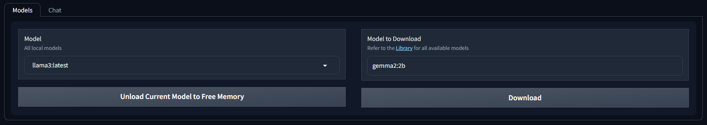
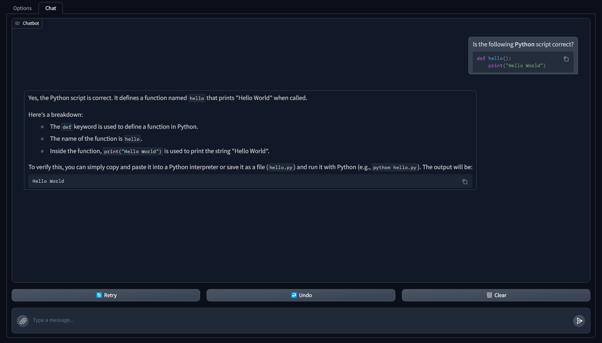

# Forge Space Ollama
This is a Space for the [Forge Webui](https://github.com/lllyasviel/stable-diffusion-webui-forge), which adds a new page for you to chat with a LLM model locally via [Ollama](https://ollama.com/), built on [Gradio](https://github.com/gradio-app/gradio)'s `ChatInterface` component.

## Requirement

- Install [Ollama](https://ollama.com/download)
- **(Optional)** Pull a model of choice
    - *(You can do so within the Space)*

## Features

- Chat with a LLM in a GUI, completely locally
- Select which model to chat with
- Enter the name to download a new model
- Manually unload the model to free up memory
- Automatically unload the model when you Terminate the space

#### Gradio Built-In Features

- Support multi-line text input
    - `Enter` for submit; `Shift + Enter` for newline
- Support markdown for both query and response
    - **\`\`\`** for code block; **\`** for inline code; **\*** for italic; **\*\*** for bold; etc.
- Support chat history
- Press **Retry** to send the same query again *(to get a different response)*
- Press **Undo** to delete the previous messages
- Press **Clear** to reset the chat history

## Roadmap
- [X] Multi-Modal Support
    - Only `images`, `.txt`, `.json`, `.yaml`, `.xml` files are currently supported
- [X] Message Stream
    - Only regular chat is supported cause... Gradio...
- [ ] Save/Load Chat History
- [ ] ... RAG?

## Configs
- [X] Default model to start with
- [X] Default tab to start with
